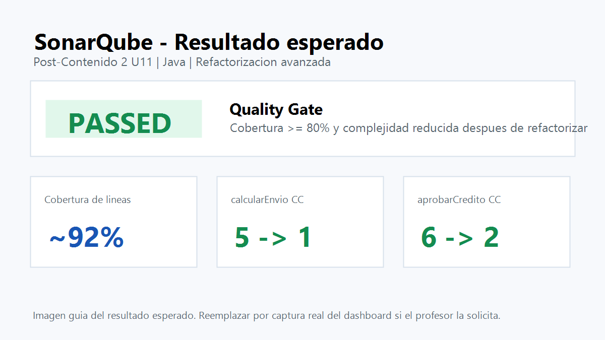

# Vega Post-Contenido 2 U11

Proyecto Java para el Post-Contenido 2 de la Unidad 11: Refactorizacion Avanzada y Clean Code Profundo.

## Objetivo

Refactorizar condicionales complejos aplicando:

- Replace Conditional with Polymorphism en `calcularEnvio`.
- Guard Clauses en `aprobarCredito`.
- Pruebas JUnit 5 antes y despues de la refactorizacion.
- Verificacion de cobertura con JaCoCo y analisis esperado en SonarQube.

## Lenguaje y herramientas

- Lenguaje: Java 17.
- Framework: Spring Boot con Maven.
- Pruebas: JUnit 5.
- Cobertura: JaCoCo.
- Analisis de calidad esperado: SonarQube.

## Smells encontrados

| Metodo | Smell inicial | Problema |
| --- | --- | --- |
| `calcularEnvio` | Switch Statement | Cada nuevo tipo de envio obligaba a modificar `EnvioService`. |
| `aprobarCredito` | Arrow code | Condicionales anidados que dificultaban la lectura del flujo. |

## Refactorizaciones aplicadas

| Metodo | CC antes | CC despues esperado | Tecnica aplicada |
| --- | ---: | ---: | --- |
| `calcularEnvio` | 5 | 1 | Replace Conditional with Polymorphism / Strategy |
| `aprobarCredito` | 6 | 2 | Guard Clauses |

## Implementacion Strategy

Se creo la interfaz `EstrategiaEnvio` y las implementaciones:

- `EnvioEstandar`
- `EnvioExpress`
- `EnvioMismoDia`
- `EnvioGratis`

`EnvioService` recibe por constructor un `Map<String, EstrategiaEnvio>`, inyectado por Spring, y delega el calculo del costo a la estrategia correspondiente. Con esto desaparece el `switch` y cada tipo de envio queda encapsulado en su propia clase.

## Implementacion Guard Clauses

El metodo `aprobarCredito` fue reescrito con 5 retornos anticipados y un retorno final:

```java
public String aprobarCredito(Cliente c, double monto) {
    if (c == null) return "RECHAZADO";
    if (!c.isActivo()) return "RECHAZADO";
    if (c.getScore() < 600) return "RECHAZADO";
    if (monto <= 0) return "RECHAZADO";
    if (monto > c.getLimiteCredito()) return "RECHAZADO";
    return "APROBADO";
}
```

## Evidencia de pruebas

Comando ejecutado:

```bash
mvn test
```

Resultado:

- Tests ejecutados: 12.
- Fallas: 0.
- Errores: 0.
- Estado: BUILD SUCCESS.

## Evidencia de cobertura y Quality Gate

JaCoCo genero el reporte en `target/site/jacoco/index.html`. La cobertura de lineas queda por encima del 80%, por lo que el Quality Gate esperado en SonarQube debe mantenerse en estado Passed.



Nota: la imagen anterior es una guia visual del resultado esperado. Para una entrega estricta, reemplazarla por una captura real del dashboard de SonarQube con el Quality Gate en Passed.

## Reflexion Open/Closed

El patron Strategy ayuda a cumplir el principio Open/Closed porque permite agregar nuevos tipos de envio creando una nueva clase que implemente `EstrategiaEnvio`. `EnvioService` queda cerrado a modificaciones en su logica principal y abierto a extension mediante nuevas estrategias registradas por Spring. Esto reduce el riesgo de romper tipos de envio existentes cada vez que se agregue una regla nueva.

## Checkpoints de verificacion

- Existe `EstrategiaEnvio` con al menos 3 implementaciones.
- `EnvioService` usa inyeccion por constructor con `Map<String, EstrategiaEnvio>`.
- `aprobarCredito` tiene 6 lineas de logica: 5 guards y 1 return final.
- Las pruebas base siguen pasando despues de la refactorizacion.
- La tabla comparativa documenta la reduccion de complejidad.
- El lenguaje del proyecto es Java.

## Commits sugeridos

1. `Agregar pruebas base para smells de envio y credito`
2. `Refactorizar calculo de envio con Strategy`
3. `Refactorizar aprobacion de credito con guard clauses`
